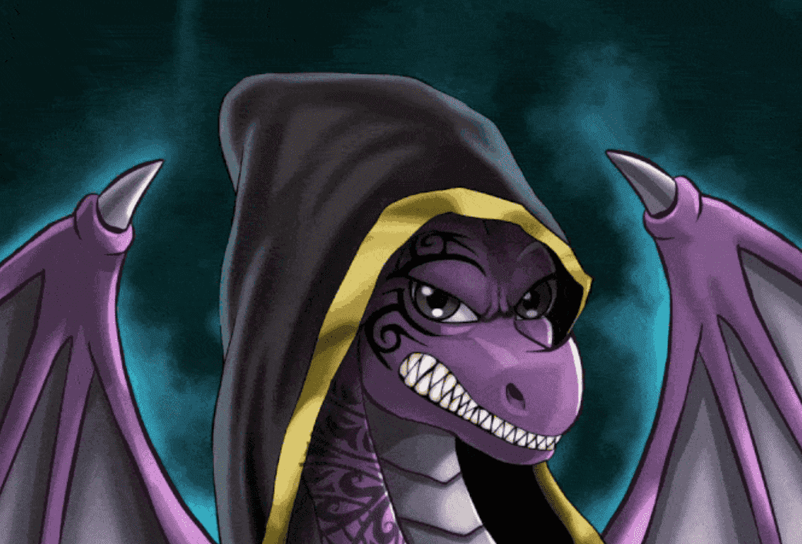

# Dragos-Collection

Dragos 是一个拥有摇滚明星团队的链上 NFT 项目。 铸币者可以为即将到来的 p2e 游戏命名他们在区块链上编码的 NFT。 区块链编码的生日、免费空投等等也是 Dragos 与众不同的原因。 

什么是德拉戈斯？
Dragos 是一个链上 NFT 项目，由 6,000 件独特的手绘艺术品组成。拥有以前成功项目的摇滚明星开发团队和超级活跃的创始人只是使 Dragos 与众不同的几个原因。
价格
Dragos 是一个去中心化的链上 NFT 项目，由 6,000 件独特的手绘艺术品组成。每个 Drago 都会被一群幸运的人从冬眠中铸造出来。在幕后和眼前创造的创新技术在发布时将是极为罕见的。

