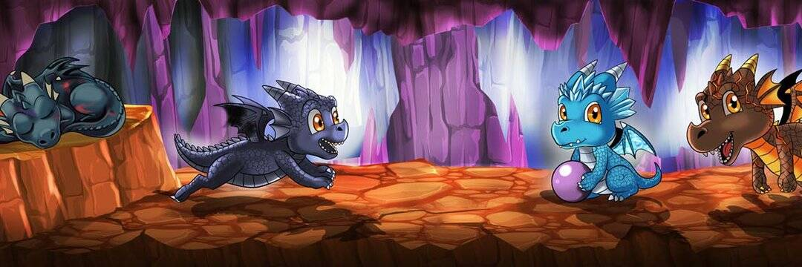

# Dragos NFT.

Dragos 是一个去中心化且完全链上的 NFT 项目，由 6,000 件独特的手绘艺术品组成，分为 4 个派别。 每个 Drago 都会被一群幸运的人从冬眠中铸造出来。 在幕后和眼前创造的创新技术在发布时将是极为罕见的。您将能够将自己的 Drago 提升为自己的。 

公开命名您的 Drago、庆祝其区块链编码生日以及与其他派系玩游戏的独特选项只是这个项目的一部分。我们的开发团队不是一个随机组合来启动项目的团队。 它是在无数年的友谊和纽带中建立起来的，这些友谊和纽带将持续远远超过一个人的一生。 他们参与过许多知名项目，包括 Neo Tokyo。 他们是创建去中心化 NFT 项目的最佳团队。

