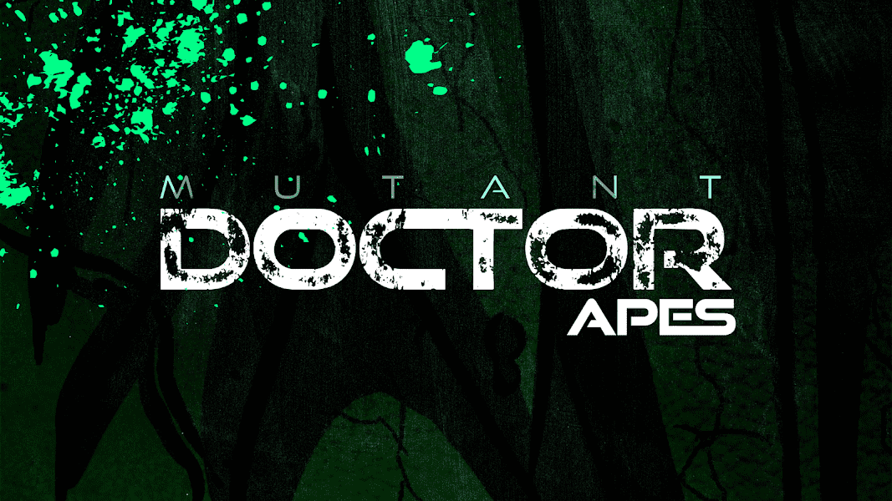

# DRAPES.WTF

窗帘在今年春天被拉回当我们的团队最初聘请 Fiverr 艺术家创作 Dr. Apes 系列时，他们认为我们打错了字，并为我们提供了数千个可生成的窗帘。 现在我们已经收集了足够多的你的 ETH，我们终于可以付钱给真正的艺术家来实现这个愿景了。 Quantum Tech 的特工 N 和专家 AL 完全手绘和可变的集合。

Dr. Apes NFT - 常见问题（FAQ）
▶ 什么是 Dr. Apes？
Dr. Apes 是一个 NFT（不可替代令牌）集合。存储在区块链上的数字艺术品集合。
▶ Dr. Apes 代币有多少？
总共有 1,106 个 Dr. Apes NFT。目前，330 位车主的钱包中至少有一本 Dr. Apes NTF。
▶ 最贵的 Dr. Apes 销售是什么？
它于 2022 年 8 月 4 日（22 天前）以 45 美元的价格售出。
▶ 猿博士最近卖了多少？
过去 30 天内售出了 8 个 Dr. Apes NFT。
▶ 什么是流行的 Dr. Apes 替代品？
许多拥有 Dr. Apes NFT 的用户还拥有 RUG.WTF、 DOJI/X CREW、 Backman's Creations和 0xHEADS。

