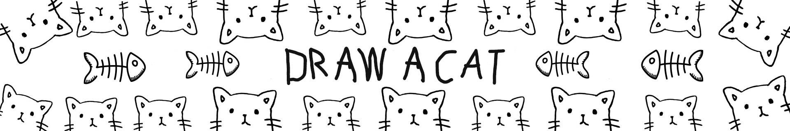

# Draw-a-Cat

没有路线图，没有网站，没有不和谐，甚至没有艺术……还没有。 画出你自己的猫，成为真正的 NFT 艺术家。 NFT degens 将绘制 1000 只猫。

Draw-a-Cat NFT - 常见问题（FAQ）
▶ 什么是画猫？
Draw-a-Cat 是一个 NFT（Non-fungible token）集合。存储在区块链上的数字艺术品集合。
▶ 有多少个 Draw-a-Cat 代币？
总共有 1,000 个 Draw-a-Cat NFT。目前，969 位所有者的钱包中至少有一个 Draw-a-Cat NTF。
▶ 最昂贵的 Draw-a-Cat 促销活动是什么？
出售的最昂贵的 Draw-a-Cat NFT 是 This cat to be draw。它于 2022-06-07（3 个月前）以 18 美元的价格售出。
▶ 最近卖出了多少只画猫？
过去 30 天内售出了 2 个 Draw-a-Cat NFT。

