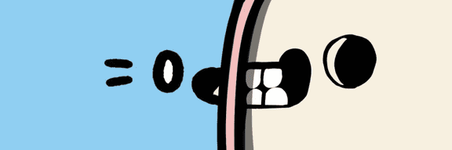

# Dr. Cool's Cat Lab

STEALTH LAUNCH 售罄！Research Lab Cool Cats 是以太坊区块链上以编程方式随机生成的 NFT 集合。 第一代由超过 99,000 个选项中的 7777 只随机组装的猫组成。 拥有各种服装、面孔、骷髅和颜色的 CCLAB - 所有的猫都很酷，但金色骷髅猫是最酷的。 每只酷猫都由独特的身体、帽子、脸和服装组成——可能性无穷无尽！

Dr. Cool 的猫实验室 NFT - 常见问题 (FAQ)
▶ 什么是 Dr. Cool 的猫实验室？
Cool 博士的猫实验室是一个 NFT（非同质代币）集合。存储在区块链上的数字艺术品集合。
▶ 酷博士的猫实验室代币有多少？
总共有 2,467 个 Dr. Cool 的 Cat Lab NFT。目前，688 位业主的钱包中至少有一个 Dr. Cool's Cat Lab NTF。
▶ Dr. Cool's Cat Lab 最近卖出了多少台？
在过去 30 天内售出 0 件 Dr. Cool's Cat Lab NFT。

