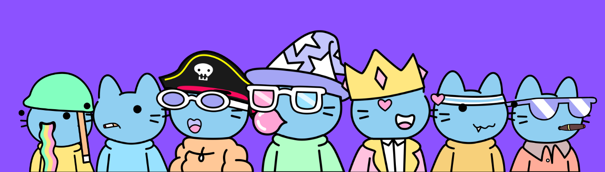

# Dream Cats NFT

Dream Cats 是 Metaverse 中 998 只独特的悠闲猫的品种集合。 献给那些在云端生活的人； 欢迎回家。 Dreamers 的世界是每个人的家园。 我们的目标是吸引富有想象力的梦想家，让孩子般的想象力自由奔放，以及热衷于在 Web3 中学习和成长的冒险家！ 访问 dream-cats.io 了解更多详情。

Dream Cats  NFT - 常见问题（FAQ）
▶ 什么是 Dream Cats ？
Dream Cats  是一个 NFT（不可替代令牌）集合。存储在区块链上的数字艺术品集合。
▶ 有多少 DDream Cats 代币？
总共有 370 个Dream Cats NFT。目前 26 位车主的钱包中至少有一个 Dreamilow NTF。
▶ 最近卖出了多少Dream Cats ？
过去 30 天内售出 0 个 Dream Cats  NFT。

