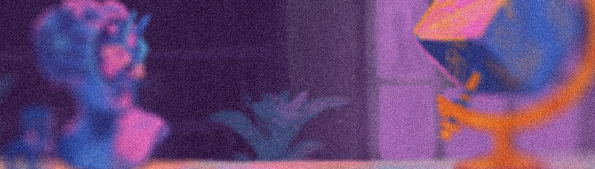

# Dreams of Alchemy

通过这些梦想，我们塑造了现实。

炼金之梦 NFT - 常见问题（FAQ）
▶ 什么是炼金梦？
Dreams of Alchemy 是一个 NFT（非同质代币）集合。存储在区块链上的数字艺术品集合。
▶ 炼金之梦代币有多少？
总共有 4 个 Dreams of Alchemy NFT。目前，83 位所有者的钱包中至少有一个 Dreams of Alchemy NTF。
▶ 炼金之梦最近卖出了多少？
过去 30 天内共售出 0 个 Dreams of Alchemy NFT。
▶ 什么是流行的炼金术梦想替代品？
许多拥有 Dreams of Alchemy NFT 的用户还拥有 -OFFWORLD-、 sick ash fonts、 Virtus & Valor和 holonick-interactive。

