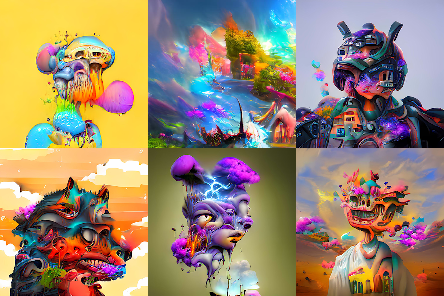

# DreamWorld V3

谁说梦想不成真？ Dreamworld 系列是 NFT 空间中的第一个此类系列。 该系列包含 200 个独一无二的 NFT，使用涉及生成对抗神经网络的数字艺术技术创建。 该系列的目标是将下一代艺术家、艺术收藏家和对抽象艺术充满热情的人聚集成一个独特的全球社区。 欢迎来到梦幻世界。

DreamWorld V3 NFT - 常见问题（FAQ）
▶ 什么是 DreamWorld V3？
DreamWorld V3 是一个 NFT（Non-fungible token）集合。存储在区块链上的数字艺术品集合。
▶ 有多少 DreamWorld V3 代币？
总共有 306 个 DreamWorld V3 NFT。目前 154 位车主的钱包中至少有一个 DreamWorld V3 NTF。
▶ 最近卖出了多少DreamWorld V3？
过去 30 天内售出 0 个 DreamWorld V3 NFT。

