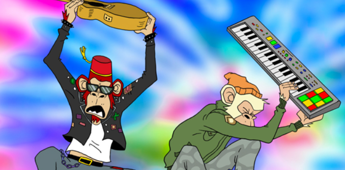

# DRIP - Bored Brothers feat. Yung Bleu

我们是无聊的兄弟。 由 Ryan Tedder (OneRepublic) 和 KYGO 开发和执行制作的基于 NFT 的全动画录音艺术家项目。 作为狂热的 NFT / Web3 爱好者，我们构思了试听我们的一些无聊猿游艇俱乐部 (BAYC) 猿的想法，以形成一个主要基于舞蹈和嘻哈的动画、多流派二人组。 这个项目源于一种强烈的愿望，即在我们各自的流派之外策划和创作音乐。

DRIP - 无聊的兄弟壮举。Yung Bleu NFT - 常见问题（FAQ）
▶ 什么是 DRIP - 无聊的兄弟壮举。永布鲁？
DRIP - 无聊的兄弟壮举。Yung Bleu 是一个 NFT（非同质代币）集合。存储在区块链上的数字艺术品集合。
▶ 多少滴滴 - 无聊的兄弟壮举。Yung Bleu 代币存在吗？
总共有 50 个 DRIP - Bored Brothers 壮举。Yung Bleu NFT。目前，42 位车主至少拥有一项 DRIP - Bored Brothers 壮举。Yung Bleu NTF 在他们的钱包里。
▶ 什么是最昂贵的 DRIP - Bored Brothers 壮举。Yung Bleu 出售？
最昂贵的 DRIP - Bored Brothers 壮举。Yung Bleu NFT 出售的是 DRIP - Bored Brothers 的壮举。永布鲁。它于 2022 年 6 月 24 日（2 个月前）以 823.4 美元的价格售出。
▶ 多少滴滴 - 无聊的兄弟壮举。Yung Bleu最近卖了？
有 2 DRIP - Bored Brothers 壮举。Yung Bleu NFT 在过去 30 天内售出。

