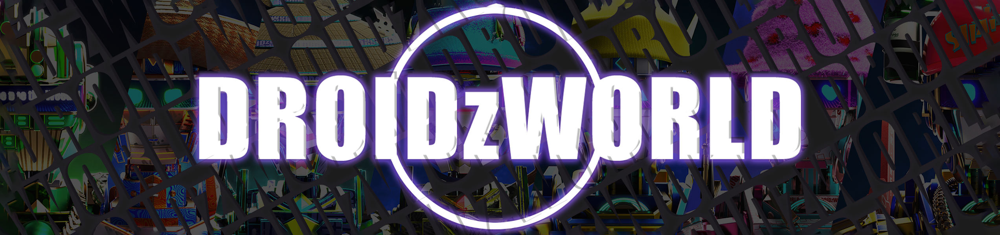

# DROIDzWORLD-OFFICIAL

第一个带有音频制作配乐的动画、CGI、NFT 合集。 通过游戏开发人员、VFX 和 Pipeline Veterans、Dreamers 和 Misfits 的镜头，我们致力于带来 6669 独特的 3D DROIDz 并以此为基础。 我们的目标是在 Web3 社区中带来有意义的交互，并在多个平台上进行扩展。

DROIDzWORLD-官方 NFT - 常见问题（FAQ）
▶ 什么是 DROIDzWORLD-OFFICIAL？
DROIDzWORLD-OFFICIAL 是一个 NFT（不可替代令牌）集合。存储在区块链上的数字艺术品集合。
▶ 有多少 DROIDzWORLD-OFFICIAL 代币？
总共有 531 个 DROIDzWORLD-OFFICIAL NFT。目前，213 位所有者的钱包中至少有一个 DROIDzWORLD-OFFICIAL NTF。
▶ 最近卖出了多少 DROIDzWORLD-OFFICIAL？
过去 30 天内售出 0 个 DROIDzWORLD-OFFICIAL NFT。
▶ 什么是流行的 DROIDzWORLD-OFFICIAL 替代品？
许多拥有 DROIDzWORLD-OFFICIAL NFT 的用户还拥有 EL NUMEROS、 DegenOkayBears、 WaterBe4nZuki和 Old Legacy。

