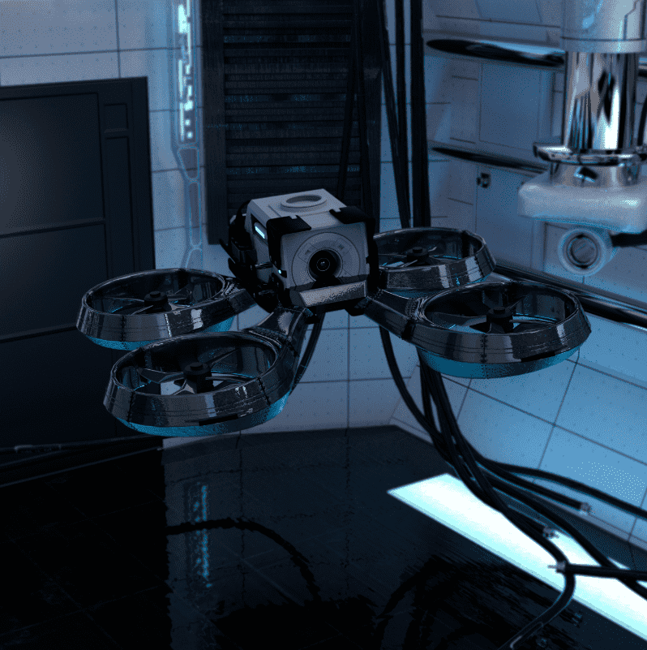

# DRONES by TRIPLE SIX

三六号无人机。 收集 1600 架无人机。 持有者在 TRIPLE SIX 生态系统中获得独家特权，包括在 ASCENSION 市场上使用的 TRIPLE SIX TOKEN $SOULS 的被动和主动质押等等。ASCENSION：https://opensea.io/collection/ascensionbyt6 LIQUID METAL： https://opensea.io/collection/liquidmetal 网站：https://triplesix.xyz/ DISCORD：https://discord.gg/triplesixjewels

TRIPLE SIX NFT 的无人机在过去 7 天内售出 39 次。TRIPLE SIX 的 DRONES 总销售额为 1.46 万美元。TRIPLE SIX NFT 的一台 DRONES 的平均价格为 37.5 美元。TRIPLE SIX 拥有 797 台无人机，总供应量为 1,600 个代币。

TRIPLE SIX NFT 的无人机 - 常见问题（FAQ）
▶ 什么是 TRIPLE SIX 的无人机？
TRIPLE SIX 的 DRONES 是一个 NFT（不可替代令牌）集合。存储在区块链上的数字艺术品集合。
▶ TRIPLE SIX 代币有多少 DRONES？
TRIPLE SIX NFT 总共有 1,600 架无人机。目前，797 位所有者的钱包中至少有一架 TRIPLE SIX NTF 的 DRONES。
▶ TRIPLE SIX 销售中最昂贵的无人机是什么？
TRIPLE SIX NFT 出售的最昂贵的无人机是 DRONE [#1094]。它于 2022-06-10（3 个月前）以 214.8 美元的价格售出。
▶ TRIPLE SIX 最近卖出了多少台 DRONES？
过去 30 天内，TRIPLE SIX NFT 共售出 102 架 DRONES。
▶ TRIPLE SIX 的无人机需要多少钱？
在过去的 30 天里，TRIPLE SIX NFT 最便宜的无人机售价低于 17 美元，最高售价超过 92 美元。过去 30 天，TRIPLE SIX NFT 的 DRONES 中位数价格为 36 美元。
▶ 有哪些流行的 DRONES by TRIPLE SIX 替代品？
许多拥有 TRIPLE SIX NFT 的 DRONES 的用户还拥有 TRIPLE SIX 的 LIQUID METAL、TRIPLE SIX的 ASCENSION、 DIGITZ GENESIS COLLECTION和 RugBurn。

