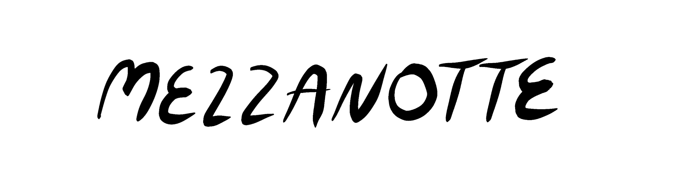

# DROPICALL by Mezzanotte

Dropicall 是艺术家 GOODNEWSFORBADGUYS 的 3,333 幅手机插图的集合。 这是 Mezzanotte 发布的第一款产品，Mezzanotte 是一个针对创新 NFT 项目的策划平台。 仍然在这里铸造 https://www.mezzanotte.us/

Mezzanotte NFT 的 DROPICALL 在过去 7 天内售出 2 次。Mezzanotte 的 DROPICALL 的总销售额为 46.66 美元。Mezzanotte NFT 的一份 DROPICALL 的平均价格为 23.3 美元。Mezzanotte 所有者有 225 个 DROPICALL，总共拥有 564 个代币。

Mezzanotte NFT 的 DROPICALL - 常见问题（FAQ）
▶ Mezzanotte 的 DROPICALL 是什么？
Mezzanotte 的 DROPICALL 是一个 NFT（不可替代令牌）集合。存储在区块链上的数字艺术品集合。
▶ Mezzanotte 代币有多少 DROPICALL？
Mezzanotte NFT 总共有 564 个 DROPICALL。目前，225 位所有者的钱包中至少有一个 Mezzanotte NTF 的 DROPICALL。
▶ Mezzanotte 出售的最昂贵的 DROPICALL 是什么？
Mezzanotte NFT 出售的最昂贵的 DROPICALL 是 Dropicall #86。它于 2022-06-12（3 个月前）以 49 美元的价格售出。
▶ Mezzanotte 最近卖出了多少 DROPICALL？
在过去 30 天内，Mezzanotte NFT 售出 4 个 DROPICALL。
▶ Mezzanotte 流行的 DROPICALL 替代品有哪些？
许多拥有 Mezzanotte NFTs DROPICALL 的用户还拥有 Cherub Fields、 Koukousei girl、 Super Metal Mons ！和 以斯拉米勒的偿付能力。
 交互式 NFT 项目：Goofball Gang。立即购买。

