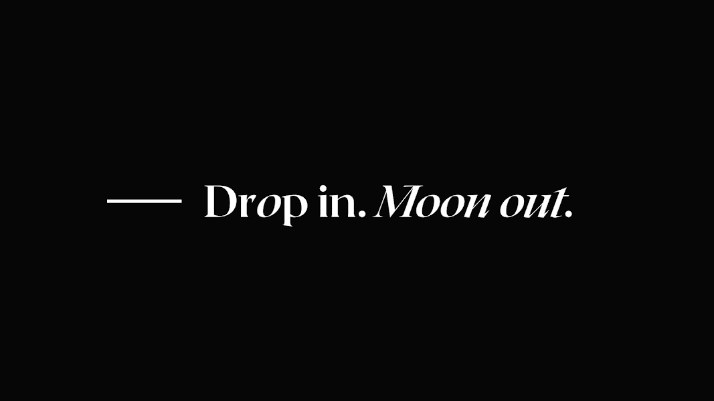

# Dropspace Mint Tickets

Drop_ Mint 门票是 500 个 ERC-721 代币的集合，可保证持有者不会发生毒气战，并且可以预售在 Dropspace 上铸造的顶级 NFT 收藏。

Dropspace Mint Tickets NFT 在过去 7 天内售出 1 次。Dropspace Mint 门票的总销售额为 112.55 美元。一张 Dropspace Mint Tickets NFT 的平均价格为 112.6 美元。有 249 名 Dropspace Mint 门票所有者，拥有 350 个代币的总供应量。

Dropspace Mint 门票 NFT - 常见问题 (FAQ)
▶ 什么是 Dropspace Mint 门票？
Dropspace Mint Tickets 是一个 NFT（不可替代令牌）集合。存储在区块链上的数字艺术品集合。
▶ 有多少 Dropspace Mint Tickets 代币？
总共有 350 个 Dropspace Mint Tickets NFT。目前，249 位所有者的钱包中至少有一张 Dropspace Mint 门票 NTF。
▶ 什么是最昂贵的 Dropspace Mint 门票销售？
售出的最昂贵的 Dropspace Mint 门票 NFT 是 Dropspace Mint Ticket #91。它于 2022-08-25（1 天前）以 112.6 美元的价格售出。
▶ 最近卖出了多少 Dropspace Mint 门票？
在过去 30 天内售出了 1 个 Dropspace Mint Tickets NFT。

