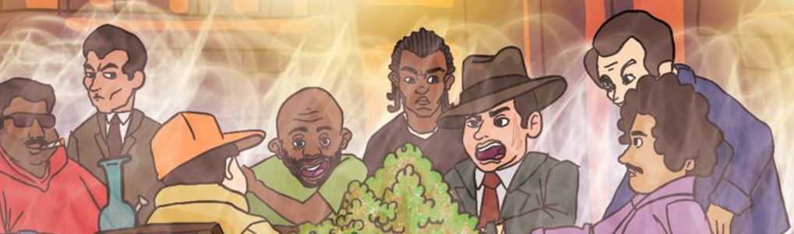

# Drug Dealers NFT

毒贩是存在于以太坊区块链上的 1222 个 ERC-721 代币的集合。 弥合了大麻产业与加密世界之间的鸿沟，拥有毒贩可以获得 IRL 实用程序和许多其他好处，同时为更大的事业做出贡献。

Drug Dealers NFT NFT 在过去 7 天内售出 3 次。Drug Dealers NFT 的总销售额为 16.47 美元。一位毒贩 NFT NFT 的平均价格为 5.5 美元。有 103 名毒贩 NFT 所有者，拥有 772 个代币的总供应量。

毒贩 NFT NFT - 常见问题 (FAQ)
▶ 什么是毒贩 NFT？
Drug Dealers NFT 是一个 NFT（Non-fungible token）集合。存储在区块链上的数字艺术品集合。
▶ 毒贩 NFT 代币有多少？
总共有 772 个毒贩 NFT NFT。目前，103 位所有者的钱包中至少有一个毒贩 NFT NTF。
▶ 最昂贵的毒贩 NFT 销售是什么？
售出的最昂贵的毒贩 NFT NFT 是 Dealer #586。它于 2022-07-04（大约 2 个月前）以 5.5 美元的价格售出。
▶ 最近卖了多少毒贩 NFT？
过去 30 天内售出了 3 个毒贩 NFT NFT。

