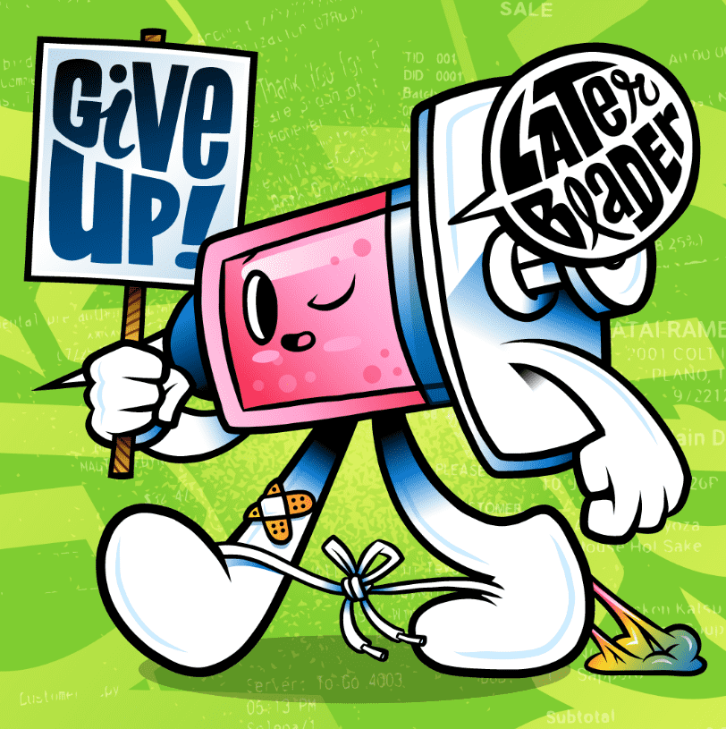

# DrugReceipts

最初是 2015 年餐厅和酒吧收据上留下的涂鸦，现在是以太坊区块链上 10,000 个独特的以编程方式生成的 NFT 的集合。 基于 Arlo Eisenberg 的艺术，Drug Receipts 建立在艺术、科学、怀疑主义、颠覆和社区的原则之上。由 Cap、Tabbi、Rex 和 Syrin 四个主要角色带领，Drug Receipts 既可爱又令人无法抗拒。 还肆无忌惮的挑衅。 Drug Receipts 对药物的好坏不持立场。 

所有的角色都故意模棱两可——可用于治疗或娱乐的非法物质。 负责任地或鲁莽地。药物收据是对细微差别的辩护。 这是反对两极分化的处方。 成为更深入、更周到的内容的推动者。 非法对话交易。 加入不断壮大的 Drug Snugglers 军团，帮助传播 Drug Receipts 独特的改变思维方式的品牌。

