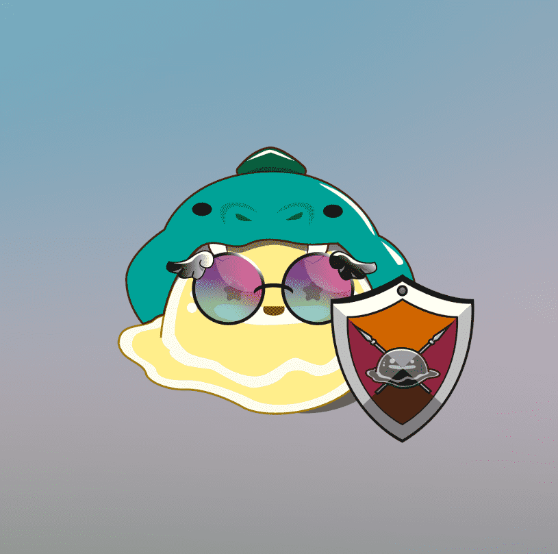

# Drunk Slime

3 醉酒史莱姆是由日本的果酒组成的兄弟姐妹。 Covid-19、猴痘、战争……这个现实世界正在发生许多危险的事情，他们想要生存。 最后，他们找到了通往元界的路。 在新世界建立自己的社区是唯一的生存方式，他们克隆了自己以增强自己的力量，通过各种服装、武器和酒的组合，创造了总共 3000 种独特的 NFT 艺术。

Drunkanime NFT - 常见问题（FAQ）
▶ 什么是醉鬼？
Drunkanime 是一个 NFT（不可替代令牌）集合。存储在区块链上的数字艺术品集合。
▶ 有多少个 Drunkanime 代币？
总共有 67 个 Drunkanime NFT。目前，13 位所有者的钱包中至少有一个 Drunkanime NTF。
▶ 最近卖出了多少部醉鬼？
过去 30 天内共售出 0 个 Drunkanime NFT。

