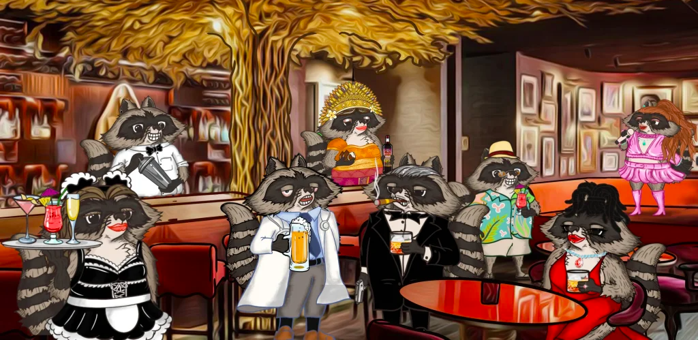

# Drunken Raccoon

欢迎来到醉浣熊的世界！ 'Drunken Raccoon' 是一个手绘的、独特的毛球系列，他们根本不会在乎！ 每个设计都有一只非常特别的浣熊，他们在 ERC721 区块链上用他们最喜欢的酒过着最好的生活。 持有者将获得特殊的额外 NFT 奖励，以显示您的浣熊已陷入醉酒状态。 他们还获得了秘密 Discord 和一年一度的全球 VIP 派对的独家访问权。“我喝酒，所以我是。” 访问 www.drunkenraccoon.io 了解更多详情

醉浣熊 NFT - 常见问题（FAQ）
▶ 什么是醉浣熊？
Drunken Raccoon 是一个 NFT（不可替代令牌）集合。存储在区块链上的数字艺术品集合。
▶ 醉浣熊代币有多少？
总共有 30 个 Drunken Raccoon NFT。目前，19 位车主的钱包中至少有一只 Drunken Raccoon NTF。
▶ 最近卖出了多少只醉浣熊？
过去 30 天内共售出 0 个 Drunken Raccoon NFT。

