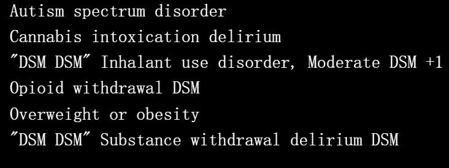

# DSM Loot

像 Loot 但 DSM-V 手动诊断。

DSM 战利品特性
DSM Loot NFT - 常见问题（FAQ）
▶ 什么是 DSM 战利品？
DSM Loot 是一个 NFT（不可替代令牌）集合。存储在区块链上的数字艺术品集合。
▶ 存在多少 DSM Loot 代币？
总共有 999 个 DSM Loot NFT。目前，304 位所有者的钱包中至少有一个 DSM Loot NTF。
▶ 最近卖出了多少 DSM Loot？
过去 30 天内售出 0 个 DSM Loot NFT。
▶ 什么是流行的 DSM Loot 替代品？
许多拥有 DSM Loot NFT 的用户还拥有 Canvas Emotions、 Scoundrels Dragons、 My Shower Diaries和 Deviant Alien Collective。

