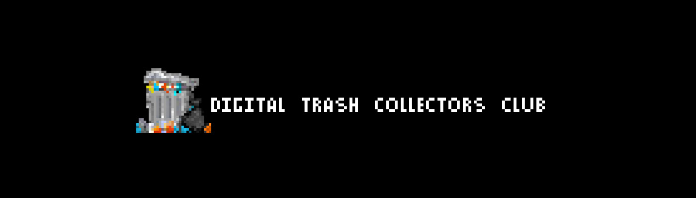

# DIGITAL TRASH COLLECTORS CLUB

由SHEEN666打造 数字垃圾收集器的聚会 这是真正的垃圾NFT，而不是最终变成数字垃圾的NFT。路线图？ ＼ＮＥ 当我有时间的时候，我会考虑如何处理垃圾。

数字垃圾收集器俱乐部 NFT - 常见问题（FAQ）

▶ 什么是 DIGITAL TRASH ？

DIGITAL TRASH  是一个 NFT（不可替代令牌）集合。存储在区块链上的数字艺术品集合。

▶ 有多少 DIGITAL TRASH  代币？

总共有 28 个 DIGITAL TRASH  NFT。目前，82 位所有者的钱包中至少有一个 DIGITAL TRASH  NTF。

▶ 最近卖出了多少DIGITAL TRASH ？

过去 30 天内售出了 1 个 DIGITAL TRASH  NFT。

