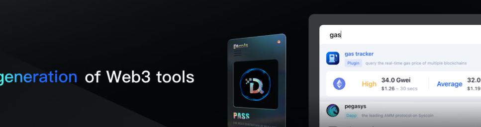

# DToolsCommonPass

D'Tools 通用通行证、终身通行证和高级通行证

DToolsCommonPass NFT 在过去 7 天内售出 18 次。DToolsCommonPass 的总销售额为 37.31 美元。一个 DToolsCommonPass NFT 的平均价格为 2.1 美元。共有 8,871 名 DToolsCommonPass 所有者，总共拥有 13,283 个代币。

DToolsCommonPass NFT - 常见问题（FAQ）
▶ 什么是 DToolsCommonPass？
DToolsCommonPass 是一个 NFT（不可替代令牌）集合。存储在区块链上的数字艺术品集合。
▶ 有多少个 DToolsCommonPass 代币？
总共有 13,283 个 DToolsCommonPass NFT。目前，8,871 位所有者的钱包中至少有一个 DToolsCommonPass NTF。
▶ 最昂贵的 DToolsCommonPass 销售是什么？
最昂贵的 DToolsCommonPass NFT 是 Common Pass #1754。它于 2022 年 6 月 12 日（2 个月前）以 10.7 美元的价格售出。
▶ 最近卖出了多少 DToolsCommonPass？
过去 30 天内售出了 64 个 DToolsCommonPass NFT。
▶ DToolsCommonPass 的费用是多少？
在过去 30 天里，最便宜的 DToolsCommonPass NFT 销售额低于 2 美元，最高销售额超过 6 美元。在过去 30 天内，DToolsCommonPass NFT 的中位价格为 2 美元。
▶ 什么是流行的 DToolsCommonPass 替代品？
许多拥有 DToolsCommonPass NFT 的用户还拥有 Cinco De Muertos、 SniperNFTbot、 WavesOnChain和 NGMIFELLAS。

