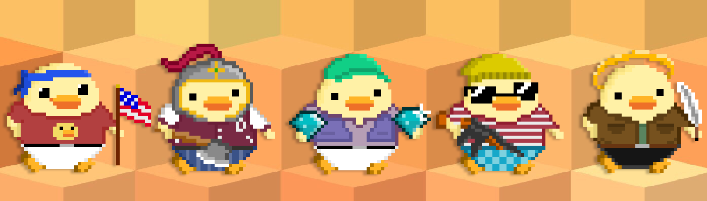

# Duccos

Duccos 是为真人手工制作的无气体多边形 NFT。 我们将经典的像素艺术动画与 NFT 随机生成相结合，在区块链上创造了 10,000 个独特的生物。 价格为 0.01 ETH。如何购买多边形 NFT：https://support.opensea.io/hc/en-us/articles/1500012889322-How-do-I-purchase-NFTs-on-Polygon-

Duccos NFT - 常见问题（FAQ）
▶ 什么是杜科斯？
Duccos 是一个 NFT（不可替代代币）集合。存储在区块链上的数字艺术品集合。
▶ 有多少 Duccos 代币？
总共有 700 个 Duccos NFT。目前，20 位车主的钱包中至少有一个 Duccos NTF。
▶ 最近卖出了多少 Duccos？
过去 30 天内售出 0 个 Duccos NFT。

