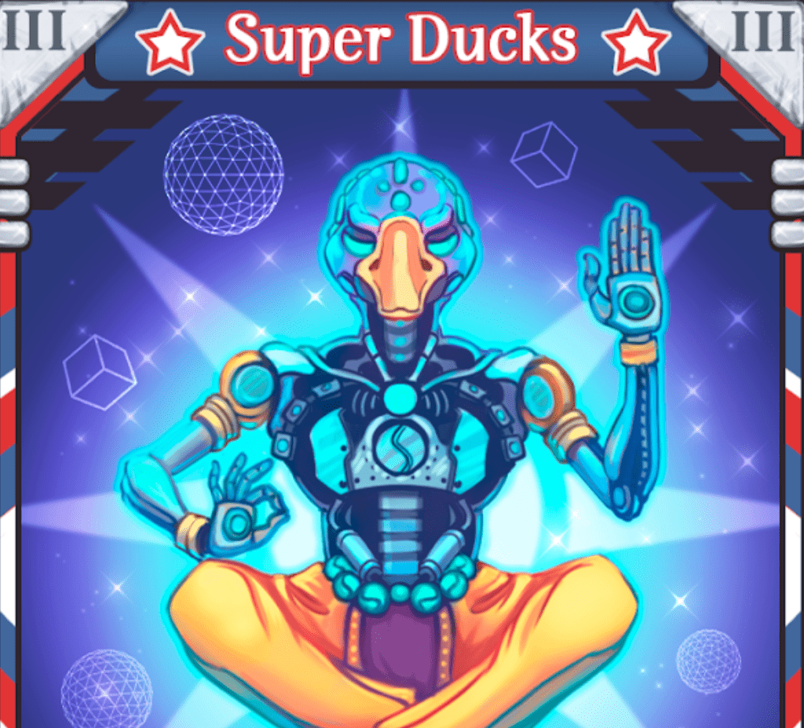

# DuckDAO Hunters

DuckDAO Hunters 是一款可收藏的纸牌游戏，参与者竞相完成 NFT 集，以便有机会在赛季中赢取奖品。
游戏由 48 张卡片组成——每张卡片都有自己的稀有度、故事和风格。 大奖将授予收集所有 48 张卡片的人或在赛季结束时拥有最多卡片的人。
DuckDAO Hunters NFT - 常见问题（FAQ）
▶ 什么是 DuckDAO 猎人？
DuckDAO Hunters 是一个 NFT（非同质代币）集合。 存储在区块链上的数字艺术品集合。
▶ 有多少 DuckDAO Hunters 代币？
总共有 53 个 DuckDAO Hunters NFT。 目前，623 位所有者的钱包中至少有一个 DuckDAO Hunters NTF。
▶ 最近卖出了多少 DuckDAO Hunters？
过去 30 天内共售出 0 个 DuckDAO Hunters NFT。

