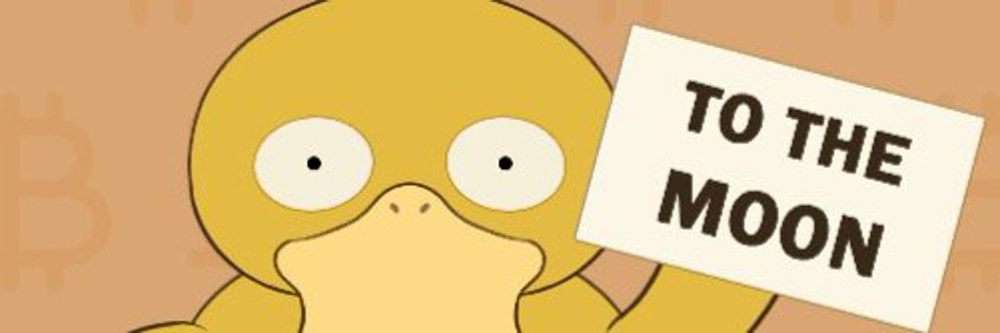

# DuckDuckWorld

鸭铃~鸭铃~一直鸭~3000 只鸭子的集合，让你发笑。 鸭铃~鸭铃~鸭一路~  你会在哪些 Marketplaces 上？🦆🦆
-我们将在发布时在 Opensea 上。 还希望在此后不久在各种其他市场上上市。

DuckDuckWorld NFT - 常见问题（FAQ）
▶ 什么是鸭鸭世界？
DuckDuckWorld 是一个 NFT（非同质代币）集合。存储在区块链上的数字艺术品集合。
▶ 有多少 DuckDuckWorld 代币？
总共有 1,542 个 DuckDuckWorld NFT。目前，453 位所有者的钱包中至少有一个 DuckDuckWorld NTF。
▶ 最近卖出了多少 DuckDuckWorld？
过去 30 天内售出 0 个 DuckDuckWorld NFT。
▶ 什么是流行的 DuckDuckWorld 替代品？
许多拥有 DuckDuckWorld NFT 的用户还拥有 Vkuzo、 Lamerz、 Sexyassclub和 Shibuki。

