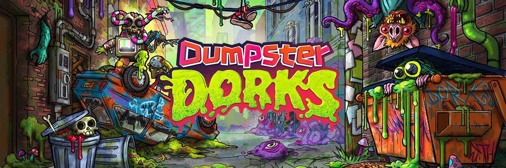

# Dumpster Dorks Collabs

DumpsterDorks Collabs 是 DumpsterDorks NFT 与各种其他项目、艺术家和品牌之间的艺术合作集合。过去 7 天没有售出 DumpsterDorks Collabs。区块链上最粗糙的 80 年代 + 90 年代垃圾/宝藏突变体。 | NFT 集合。 薄荷在这里：http://dumpsterdorks.com

DumpsterDorks Collabs NFT - 常见问题（FAQ）
▶ 什么是 DumpsterDorks Collabs？
DumpsterDorks Collabs 是一个 NFT（不可替代令牌）集合。存储在区块链上的数字艺术品集合。
▶ 有多少 DumpsterDorks Collabs 代币？
总共有 5 个 DumpsterDorks Collabs NFT。目前，2,011 位所有者的钱包中至少有一个 DumpsterDorks Collabs NTF。
▶ 最近卖出了多少 DumpsterDorks Collabs？
在过去 30 天内售出了 0 个 DumpsterDorks Collabs NFT。

