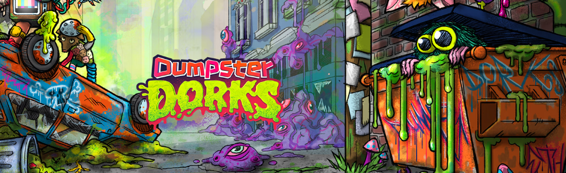

# DumpsterDorks

DumpsterDorks 是一个 NFT 集合，包含 5,000 个随机生成的头像，这些头像作为 ERC-721 令牌存储在以太坊区块链上，并托管在星际文件系统 (IPFS) 上。 由 700 多个最病态的手绘元素衍生而来，在星际垃圾场的这一侧，每个 Dork 都从失去的四肢、损坏的设备和危险废物等好奇心中积累起来，以及特殊的（和稀有的！）惊喜。 潜入垃圾箱并获得一些值得珍惜的垃圾！

DumpsterDorks NFT 在过去 7 天内售出 69 次。DumpsterDorks 的总销售额为 5.92 万美元。一个 DumpsterDorks NFT 的平均价格为 85.8 美元。有 1,715 名 DumpsterDorks 所有者，总共拥有 5,000 个代币

