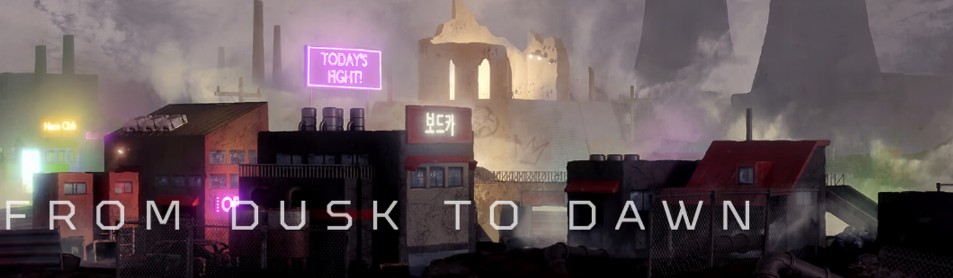

# Dusktopia

Dusktopia 是一个赛博朋克世界构建 P2E 元宇宙，具有三种不同类型的 NFT——土地、属性和化身。 Dusktopia 将从 5555 个土地 NFT 的创世下降开始。 每个 NFT 都将成为 Dusktopian 故事情节的一部分，并将属于四个主要“世界”之一——Blighted Badlands、Glacial Frontier、Sundered Grove 和 Sky Citadel。从长远来看，该团队计划开发一个成熟的元宇宙 玩家将能够以有意义的方式与所有资产进行交互的体验。 我们的目标不是建立一个线性的 $DAWN 奖励系统，而是建立一个真实世界的系统，在该系统中，玩家将获得并使用 $DAWN 来在游戏化体验中采取行动。Dusktopia 是元宇宙爱好者聚集在一起建立他们的权力基础的地方。 今天就加入我们，开辟自己的道路——从黄昏到黎明。

