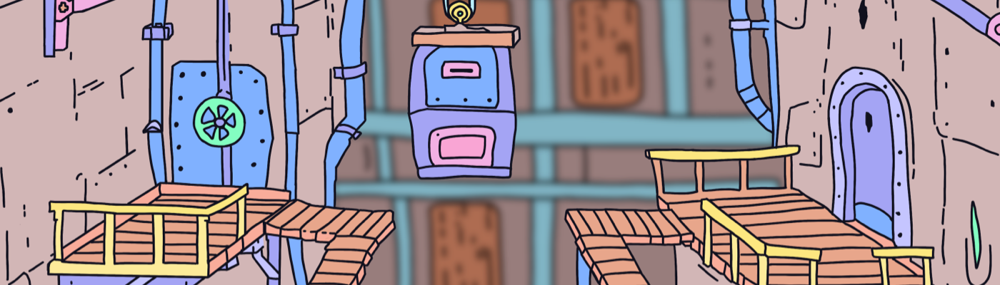

# Dwarfies Megaverse

在 https://mint.dwarfies.com 上为您的 Dwarfie 铸造 36 个 maticDwarfie，首先收集 10,000 个具有 250 多个独特手绘特征的化身，让您成为我们即将在多边形区块链上访问我们即将推出的 Megaverse 的会员。 每个 Dwarfie 持有者都是独一无二的，并且可以在我们即将推出的平台中获得独家功能、掉落和新体验。 矮人持有者将能够去狩猎、约会、收集宝石和手工艺品、结识新生物、太空旅行等等，以扩展 The Megaverse。 可能性是无止境。 访问 dwarfies.com 了解更多详情。

Dwarfies Megaverse NFT - 常见问题（FAQ）
▶ 什么是小矮人巨型宇宙？
Dwarfies Megaverse 是一个 NFT（不可替代令牌）集合。存储在区块链上的数字艺术品集合。
▶ 有多少 Dwarfies Megaverse 代币？
总共有 1,028 个 Dwarfies Megaverse NFT。目前，268 位所有者的钱包中至少有一个 Dwarfies Megaverse NTF。
▶ 最近卖出了多少个侏儒超级宇宙？
过去 30 天内共售出 0 个 Dwarfies Megaverse NFT。

