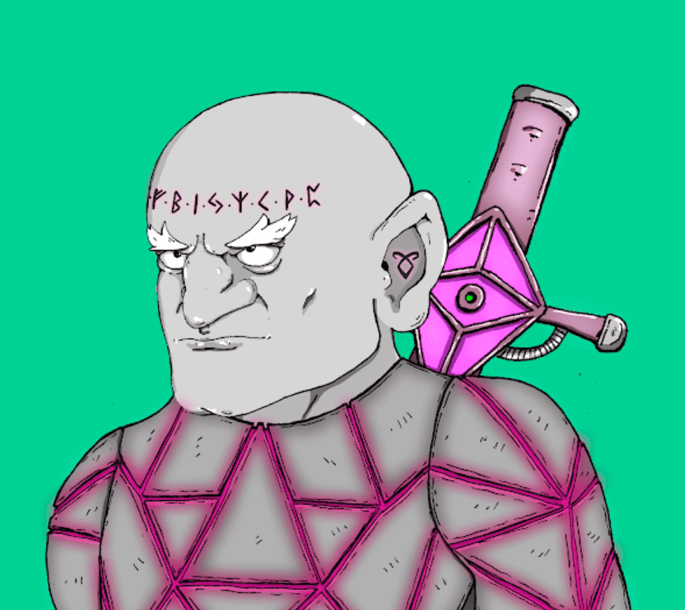

# Dwarfs Alt World (DAW)

过去 7 天没有出售 Dwarfs Alt World (DAW)。
DAW 代币是一个独特的项目，因为它的生态系统将结合 NFT 和 DEFI 功能。
Dwarfs Alt World (DAW) NFT - 常见问题 (FAQ)
▶ 什么是矮人替代世界 (DAW)？
Dwarfs Alt World (DAW) 是一个 NFT (Non-fungible token) 集合。 存储在区块链上的数字艺术品集合。
▶ 有多少 Dwarfs Alt World (DAW) 代币？
总共有 1,037 个 Dwarfs Alt World (DAW) NFT。 目前，478 位所有者的钱包中至少有一个 Dwarfs Alt World (DAW) NTF。
▶ 最近卖出了多少 Dwarfs Alt World (DAW)？
过去 30 天内售出了 0 个 Dwarfs Alt World (DAW) NFT。

