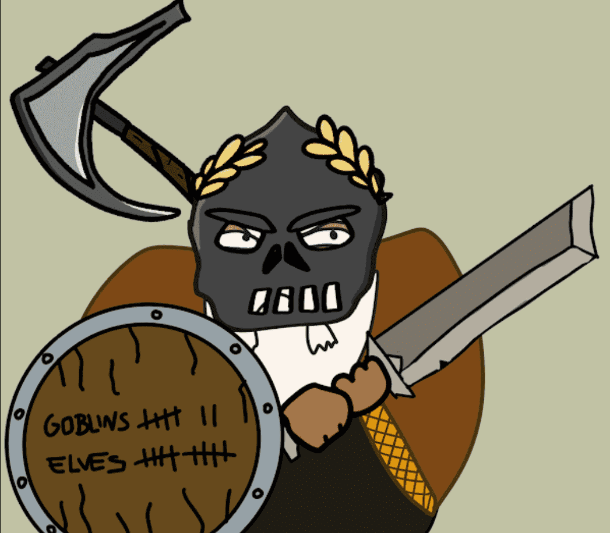

# dwarftown.wtf

第3333章，挥舞你的斧头，我们将到达你的区域
Dwarftown wtf NFT - 常见问题（FAQ）
▶ 什么是矮人镇wtf？
Dwarftown wtf 是一个 NFT（Non-fungible token）集合。 存储在区块链上的数字艺术品集合。
▶ Dwarftown wtf 代币有多少？
总共有 3,333 个 Dwarftown wtf NFT。 目前，400 位车主的钱包里至少有一个 Dwarftown wtf NTF。
▶ 最近卖出了多少矮人镇wtf？
过去 30 天内售出了 1 个 Dwarftown wtf NFT。
▶ 什么是流行的 Dwarftown wtf 替代品？
许多拥有 Dwarftown wtf NFT 的用户还拥有 Teen Ape Gang Mutants (TAGM)、doodlebirdswtf、The Floor 和各种书籍。

