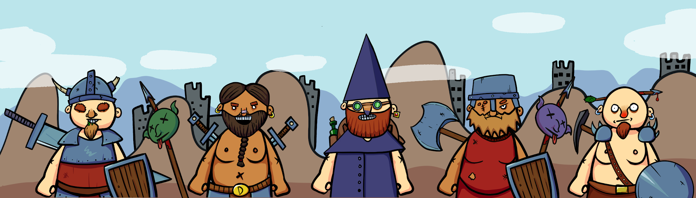

# DWARFTowns.wtf

DWARFTowns.wtf NFT 在过去 7 天内售出 1 次。DWARFTowns.wtf 的总销售额为 $0。一个 DWARFTowns.wtf NFT 的平均价格为 0 美元。有 614 名 DWARFTowns.wtf 所有者，拥有 4,732 个代币的总供应量。

DWARFowns.wtf NFT - 常见问题（FAQ）
▶ 什么是 DWARFWowns.wtf？
DWARFowns.wtf 是一个 NFT（非同质代币）集合。存储在区块链上的数字艺术品集合。
▶ 存在多少个 DWARFWowns.wtf 代币？
总共有 4,732 个 DWARFowns.wtf NFT。目前 614 位所有者的钱包中至少有一个 DWARFowns.wtf NTF。
▶ 最昂贵的 DWARFWowns.wtf 销售是什么？
售出的最昂贵的 DWARFTowns.wtf NFT 是 DwarfTown..WTF #1371。它于 2022-07-01（大约 2 个月前）以 0 美元的价格出售。
▶ 最近卖出了多少 DWARFWowns.wtf？
过去 30 天内共售出 1 个 DWARFTowns.wtf NFT。
▶ 什么是流行的 DWARFWowns.wtf 替代品？
许多拥有 DWARFTowns.wtf NFT 的用户还拥有 EL NUMEROS、 DegenOkayBears、 WaterBe4nZuki和 Old Legacy。

