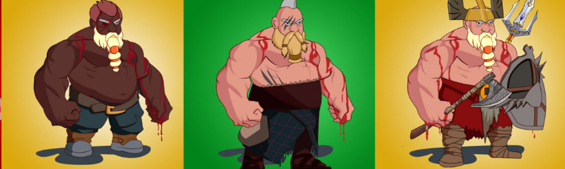

# DwarfVille

DwarfVille NFT - 常见问题（FAQ）
▶ 什么是矮人村？
DwarfVille 是一个 NFT（不可替代代币）集合。存储在区块链上的数字艺术品集合。
▶ 有多少 DwarfVille 代币？
总共有 1,491 个 DwarfVille NFT。目前，1,304 位所有者的钱包中至少有一个 DwarfVille NTF。
▶ DwarfVille 最昂贵的销售是什么？
出售的最昂贵的 DwarfVille NFT 是 . 它于 2022 年 6 月 9 日（3 个月前）以 89.7 美元的价格售出。
▶ 最近卖出了多少 DwarfVille？
过去 30 天内售出了 41 个 DwarfVille NFT。
▶ DwarfVille 的价格是多少？
在过去 30 天里，最便宜的 DwarfVille NFT 销售额低于 25 美元，最高销售额超过 54 美元。过去 30 天内，DwarfVille NFT 的中位价格为 36 美元。
▶ 什么是流行的 DwarfVille 替代品？
许多拥有 DwarfVille NFT 的用户还拥有 Sneaker Monsters NFT-Ablos Armada、 SubstandardNFT、 1R 7R335 - The Otherworld和 kokoKOKOkoko。

