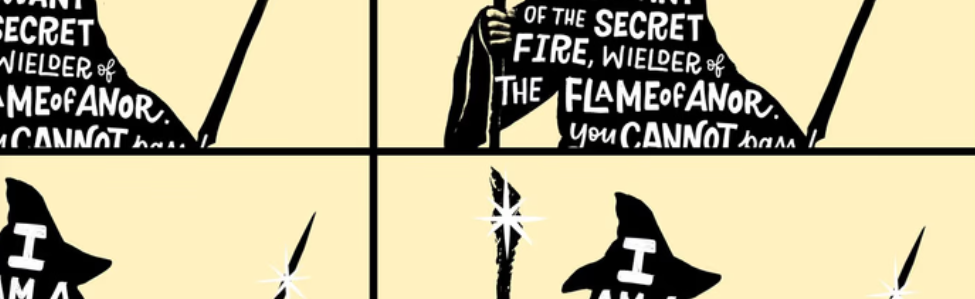

# E.R.V Gandalf

E.R.V Gandalf 集合了 3000 个独立的 UT 角色，他们装扮成魔术师，为更多的 ETH 链上的 NFT 爱好者提供一个关于魔法世界的新奇幻展览，致力于在主题艺术品中推广 web3 中的魔法衍生品。 官网：https://erv-gandalf.com/ 其中“E”代表空灵，“R”代表复仇，“V”代表Vendetta。 这些元素共同创造了这个怪诞的魔法！ 或许，这三千巫师没有聚集在一起，“都是雾里看花，白痴。”

E.R.V Gandalf NFT - 常见问题（FAQ）
▶ 什么是E.R.V Gandalf ？
E.R.V Gandalf 是一个 NFT（不可替代代币）集合。存储在区块链上的数字艺术品集合。
▶ 有多少个E.R.V Gandalf 代币？
总共有 4 个 E.R.V Gandalf  NFT。目前 10 位所有者的钱包中至少有一个 E.R.V Gandalf  NTF。
▶ 最近卖出了多少个 E.R.V Gandalf ？
过去 30 天内售出 0 个 E.R.V Gandalf NFT。

