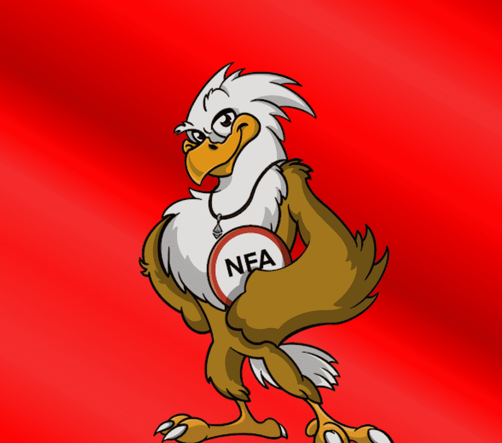

# Eager Eagles NFT

Eager Eagles NFT NFT - 常见问题（FAQ）
▶ 什么是 Eager Eagles NFT？
Eager Eagles NFT 是一个 NFT（不可替代代币）集合。存储在区块链上的数字艺术品集合。
▶ Eager Eagles NFT 代币有多少？
总共有 4,983 个 Eager Eagles NFT NFT。目前，728 位所有者的钱包中至少有一个 Eager Eagles NFT NTF。
▶ 最昂贵的 Eager Eagles NFT 销售是什么？
出售的最昂贵的 Eager Eagles NFT NFT 是 Eager Eagle #4356。它于 2022 年 7 月 4 日（2 个月前）以 82.3 美元的价格售出。
▶ 最近卖出了多少 Eager Eagles NFT？
过去 30 天内售出了 394 个 Eager Eagles NFT NFT。
▶ Eager Eagles NFT 需要多少钱？
在过去 30 天里，Eager Eagles NFT NFT 最便宜的销售额低于 6 美元，最高销售额超过 15 美元。在过去 30 天内，Eager Eagles NFT NFT 的中位价格为 9 美元。
▶ 有哪些流行的 Eager Eagles NFT 替代品？
许多拥有 Eager Eagles NFT NFT 的用户还拥有 CatBoners - The Beginning、 h8rschix、 Rich Fox Club NFT和 CryptoBozosNFT。

