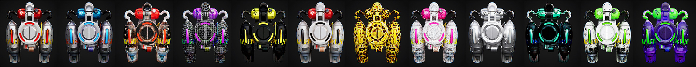

# EAR - DAWN

我们来自代号为 EAR 的 2056 年太阳系创造者联盟，负责在现实世界中创造虚拟物体。 我们的使命是穿越到 2022 年，带回未来的设备，为人类多元宇宙时间线创造更多可能性。 我们是一群可爱的超宇宙极客，一群做白日梦的人，有时是怪人，但擅长游戏和数学。 这是我们的第一个项目——“黎明”。 《黎明》是以喷气背包为起点的外装防弹衣系列，因为这是2056年单人极客装备的原型系列。

EAR - DAWN NFT - 常见问题（FAQ）
▶ EAR - DAWN 是什么？
EAR - DAWN 是一个 NFT（不可替代令牌）集合。存储在区块链上的数字艺术品集合。
▶ EAR - DAWN 代币有多少？
总共有 141 个 EAR - DAWN NFT。目前 70 位所有者的钱包中至少有一个 EAR - DAWN NTF。
▶ EAR - DAWN 最近卖出了多少？
过去 30 天内售出 0 件 EAR - DAWN NFT。

