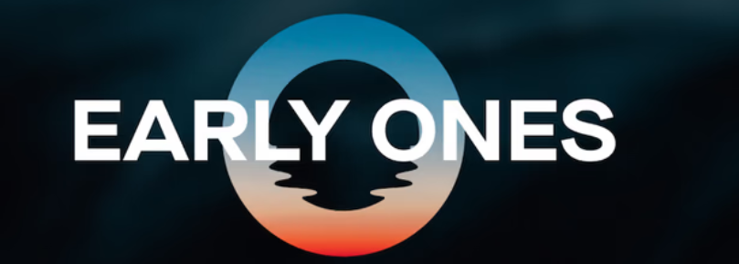

# EARLY ONES | Genesis Membership

早期的 - 创世纪会员通行证。 使用此通行证访问 EARLY ONES 平台并获得奖励！

早起| Genesis Membership NFT 在过去 7 天内售出 5 次。EARLY ONES的总销量| 创世纪会员资格为 136.68 美元。EARLY ONES 的平均价格 | Genesis Membership NFT 是 27.3 美元。有366个早期的| Genesis Membership 所有者，拥有 650 个代币的总供应量。

早起| Genesis Membership NFT - 常见问题（FAQ）
▶ 什么是早教 | 创世纪会员？
早起| Genesis Membership 是一个 NFT（Non-fungible token）集合。存储在区块链上的数字艺术品集合。
▶ 有多少 EARLY ONES | 创世纪会员代币存在吗？
总共有 650 名早起者 | Genesis Membership NFT。目前 366 位车主至少有一个 EARLY ONES | Genesis Membership NTF 在他们的钱包里。
▶ 什么是最昂贵的 EARLY ONES | 创世纪会员销售？
最贵的早起| Genesis Membership NFT 出售是 早期的 | 创世纪会员通行证。它于 2022 年 6 月 24 日（2 个月前）以 57.1 美元的价格售出。
▶ 有多少 EARLY ONES | 创世纪会员最近被卖了？
有18个早期的| 过去 30 天内售出的 Genesis Membership NFT。
▶ EARLY ONES 多少钱 | 创世纪会员费用？
近 30 天最便宜的 EARLY ONES | Genesis Membership NFT 销售额低于 22 美元，最高销售额超过 56 美元。EARLY ONES 的中位数价格 | Genesis Membership NFT 在过去 30 天内为 43 美元。
▶ 什么是流行的EARLY ONES | 创世纪会员替代品？
许多拥有EARLY ONES的用户| Genesis Membership NFT 还拥有 Genesis Alpha Pass - NFTuloan、 FingerX、 kev0（多边形）和 MetaCity Real Estate。

