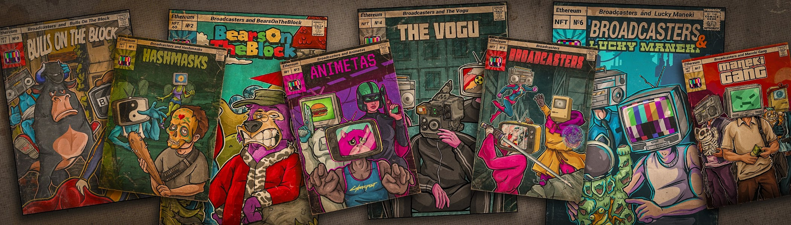

# EarlyBroadcasterComics

解开以太坊区块链上最古老的 NFT 生成集合。 广播员不仅是完美的头像，还可以让您获得独家社区福利。 您的广播员是参加为该项目计划的所有比赛和抽奖活动的门票，让您有机会赢得 BIG。 时间在流逝，你和我们在一起吗？

EarlyBroadcasterComics NFT - 常见问题（FAQ）
▶ 什么是 EarlyBroadcasterComics？
EarlyBroadcasterComics 是一个 NFT（不可替代令牌）集合。存储在区块链上的数字艺术品集合。
▶ 有多少 EarlyBroadcasterComics 代币？
总共有 555 个 EarlyBroadcasterComics NFT。目前，371 位所有者的钱包中至少有一份 EarlyBroadcasterComics NTF。
▶ 最近卖出了多少 EarlyBroadcasterComics？
过去 30 天内共售出 0 个 EarlyBroadcasterComics NFT。

