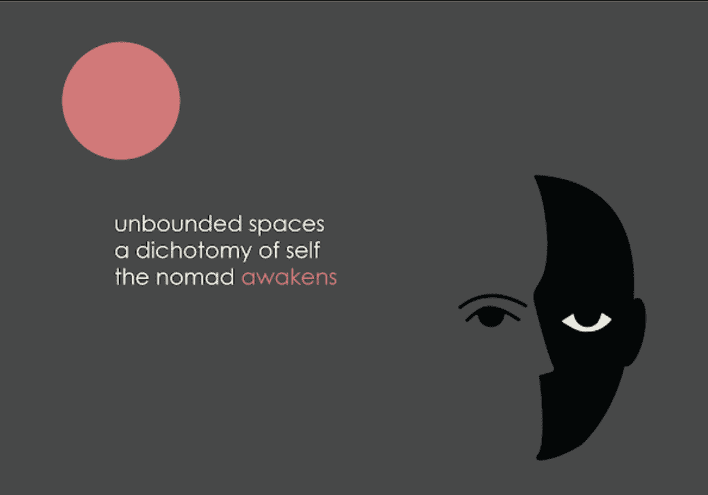

# .earth postcard

.earth 明信片 NFT - 常见问题 (FAQ)
▶ 什么是.earth 明信片？
.earth 明信片是一个 NFT（不可替代令牌）集合。存储在区块链上的数字艺术品集合。
▶ .earth 明信片代币有多少？
总共有 500 个 .earth 明信片 NFT。目前，421 位所有者的钱包中至少有一张 .earth 明信片 NTF。
▶ 什么是最昂贵的 .earth 明信片销售？
出售的最昂贵的 .earth 明信片 NFT 是 .earth 明信片。它于 2022-06-05（3 个月前）以 182 美元的价格售出。
▶ 最近卖出了多少张.earth 明信片？
过去 30 天内售出了 13 个 .earth 明信片 NFT。
▶ .earth 明信片要多少钱？
在过去 30 天内，最便宜的 .earth 明信片 NFT 销售额低于 96 美元，最高销售额超过 179 美元。.earth 明信片 NFT 的中位价格在过去 30 天内为 137 美元。
▶ 有哪些流行的 .earth 明信片替代品？
许多拥有 .earth 明信片 NFT 的用户还拥有 Afterlife ID、 e9Art、 Blazed Cats和 Dr. Apes。

