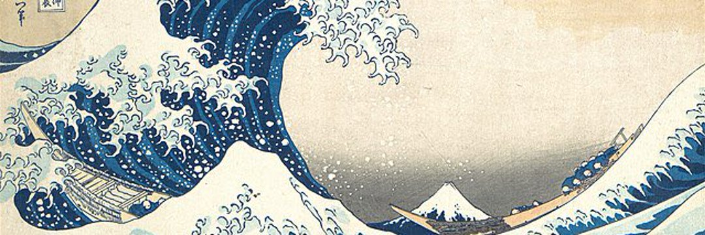

# Earth Sky and Sea

地球、天空和海洋被称为宇宙世界。 在一些较小的世界中，巨大的宇宙射线爆发，行星死亡。 其他的更像是大宇宙射线，有时也被称为宇宙虚空。

Earth Sky and Sea 是一系列跨平台发布的系列，其中包含我最喜欢的拍摄对象，地球的岩石露头。这些包括海堆和拱门、巨石、尖顶和拱门以及落基山脉。我喜欢地球的这些延伸延伸到天空并将天空和土地统一起来的方式。

Timeless 是一小部分版本，在短暂的天空下捕捉永恒的风景。该系列通过在白天和晚上展示相同的位置来探索时间的流逝。第一滴是犹他州两个地点的 4 张照片，每个地点有 20 个版本。

关于艺术家 Arwin Levinson 是一位住在拉斯维加斯的风景摄影师，他喜欢在戏剧性的天空下拍摄美国西部的美景。她的目标是捕捉最能增强她最喜欢的位置的条件。

