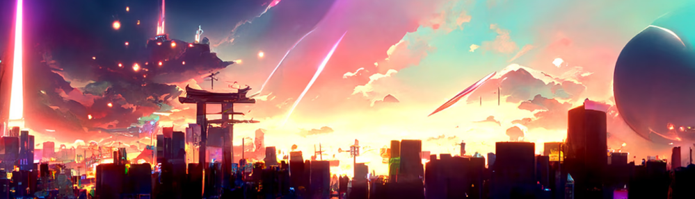

# Earths Rebirth Chapter 2

在地球重生的第 2 章中，我们回到了“闪电侠”发生之前......对于科技探索和发现来说，这是一个了不起的一年。 经济蓬勃发展，空气中充满希望的感觉是不可否认的。 一个人潮涌动的城市，他们不知道将要发生什么。世界科技博览会的时间到了； 各种新技术的展示，包括智能电器和无人机。 但也有传言说，一个将彻底改变世界的绝密政府项目。很多人想看，但只有少数人被抽签参加，不知何故，我是其中之一。我们不知道是什么 当我们到达世博会时，我们正在等待...... 在排队等候时 突然一道闪光划过天空，超越了城市。 没有人知道发生了什么。 人们一被它吞没就消失了。他们被抛在后面，没有人知道他们发生了什么事......

