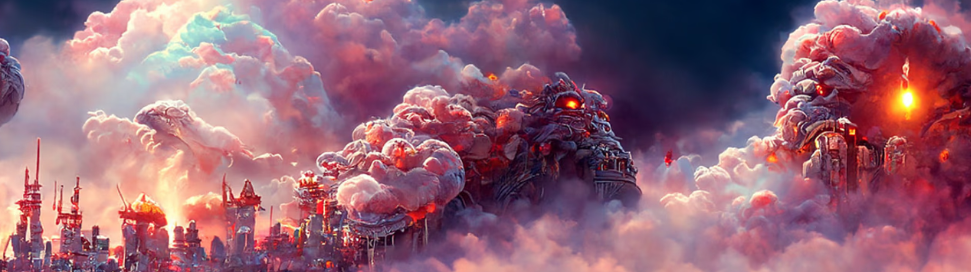

# Earths Rebirth Chapter 3

“光是逃不掉的……”你看着附近的一个幸存者，问他们是否还好。他们盯着你，然后慢慢地开始歇斯底里地大笑。你问他们有什么好笑的，但他们只是继续笑，好像情况没有任何问题。就在这时，另一道光束射了下来，那个人消失了……闪电划过天空，照亮了上方和下方城市周围的云层。一道光芒骤然从天而降，让人惊叫出声，双手捂住眼睛。混乱和混乱随之而来，漂浮的物体不知从何而来，人们开始像河流上的树叶一样漂浮在空中。他们中的一些人开始再次落回地球，而其他人仍然向上漂浮到永恒。只有少数人似乎对“闪电侠”的影响免疫。一些被它击中的人似乎有了某种免疫力，而另一些人则看着周围的人消失或开始向天空飘去，痛苦或恐惧地尖叫着。闪光吞没了城市，喷出烟雾，使接触到光的人蒸发。光之闪烁吞没了这座城市，喷出烟雾，使接触到光的人蒸发。当人们在你眼前蒸发时，你惊恐地环顾四周。随着闪光继续向各个方向发射，巨大的烟雾在空中爆炸。对一些人来说，只有光，直到雾笼罩着他们。在某一时刻，光会触及你，并将你传送到山顶，而其他人则俯瞰着被闪光和烟雾所超越的城市。如此混乱的事物怎么会如此美丽？混乱中怎么会有美？你环顾四周，看看你是否认识任何人，但令你沮丧的是，他们对你来说都是陌生人。接下来我们该怎么办？我们去哪里？这一切是什么？同样的问题不断地在一小群人中喃喃自语，他们只是看着他们的家园被一种你只能在漫画中读到的力量摧毁。您将首先关注哪个问题？

