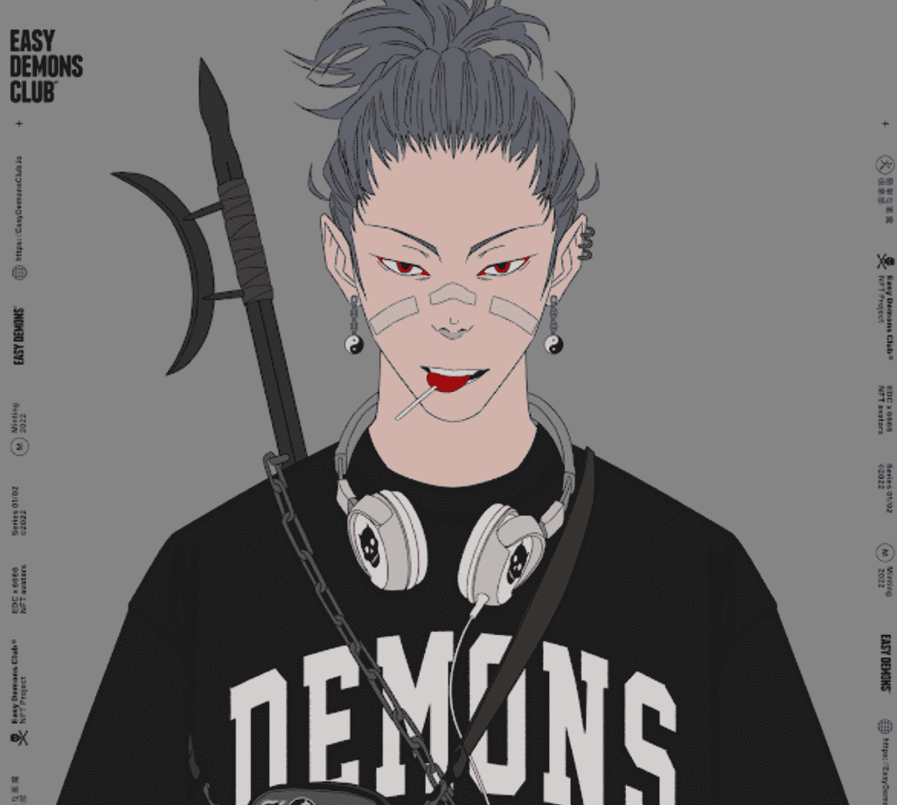

# Easy Demons Club Official

Easy Demons Club 官方 NFT - 常见问题 (FAQ)
▶ 什么是Easy Demons Club官方？
Easy Demons Club Official 是一个 NFT（非同质代币）集合。存储在区块链上的数字艺术品集合。
▶ Easy Demons Club 官方代币有多少？
总共有 6,666 个 Easy Demons Club 官方 NFT。目前，2,227 位车主的钱包中至少有一个 Easy Demons Club 官方 NTF。
▶ Easy Demons Club 官方促销中最贵的是什么？
最昂贵的 Easy Demons Club 官方 NFT 是 Easy Demons Club #450。它于 2022 年 6 月 9 日（3 个月前）以 540.7 美元的价格售出。
▶ 最近卖了多少 Easy Demons Club Official？
过去 30 天内售出了 343 个 Easy Demons Club 官方 NFT。
▶ Easy Demons Club 官员的费用是多少？
过去 30 天，Easy Demons Club 官方 NFT 最便宜的销售额低于 22 美元，最高销售额超过 98 美元。过去 30 天内，Easy Demons Club 官方 NFT 的中位价格为 45 美元。
▶ 什么是流行的 Easy Demons Club 官方替代品？
许多拥有 Easy Demons Club 官方 NFT 的用户还拥有 Easy Demons Club 的 Yokais、GENE_SIS: The Girls of Armament、Ape Reunion 和 Torrealba 的 Ugly People。

