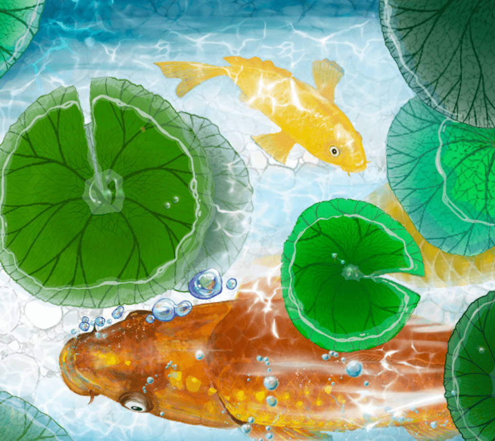

# Eternal Collections - Cherish the moment

永恒典藏：春（Chun）——珍惜当下。
来自演员、作家和艺术家 Edmund Chen。
永恒收藏 - 珍惜当下 NFT - 常见问题（FAQ）
▶ 什么是永恒收藏 - 珍惜当下？
永恒收藏 - 珍惜当下是一个 NFT（不可替代令牌）收藏。 存储在区块链上的数字艺术品集合。
▶ 多少永恒收藏 - 珍惜代币存在的那一刻？
总共有 333 个永恒收藏 - 珍惜当下的 NFT。 目前 32 位拥有者至少拥有一个永恒收藏品 - 珍惜钱包中的 NTF 时刻。
▶ 最近卖出了多少永恒系列 - 珍惜当下？
有 0 个永恒收藏 - 珍惜过去 30 天内售出 NFT 的那一刻。

