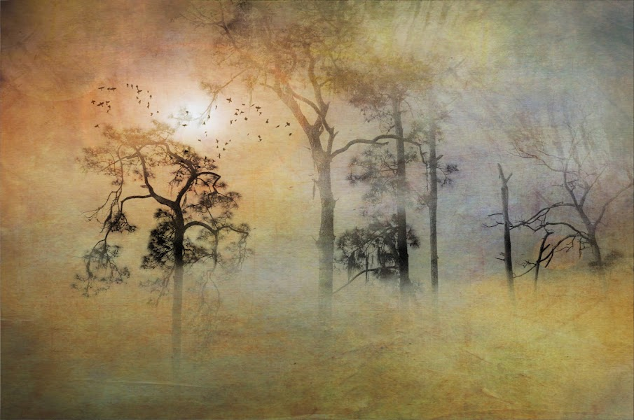

# Echoes and Whispers

Echoes and Whispers 是一组受日本和中国传统绘画启发的照片集。 我一直认为它是最古老、最精致的视觉艺术，因为它并不打算准确地描绘自然或现实，而是解释自然的情感影响。在研究这些风景艺术作品的创作过程中，我深深地爱上了 这个概念很简单，但它们都具有强大的含义。 柔和的层次感在舒缓的大气纹理上形成了令人振奋的元素，如墨水、木块纹理、笔触和暖色。 我受到启发，以不同的方式看待我的风景，并旨在将我的风格应用到明亮平坦的色彩区域、大胆的轮廓线和强调前景和背景的独特空间暗示方式。我认为这个系列是精心制作且意义深远的奉献 这种类型的艺术长期以来一直激励着我，并帮助我想象出一种新的摄影方式。

