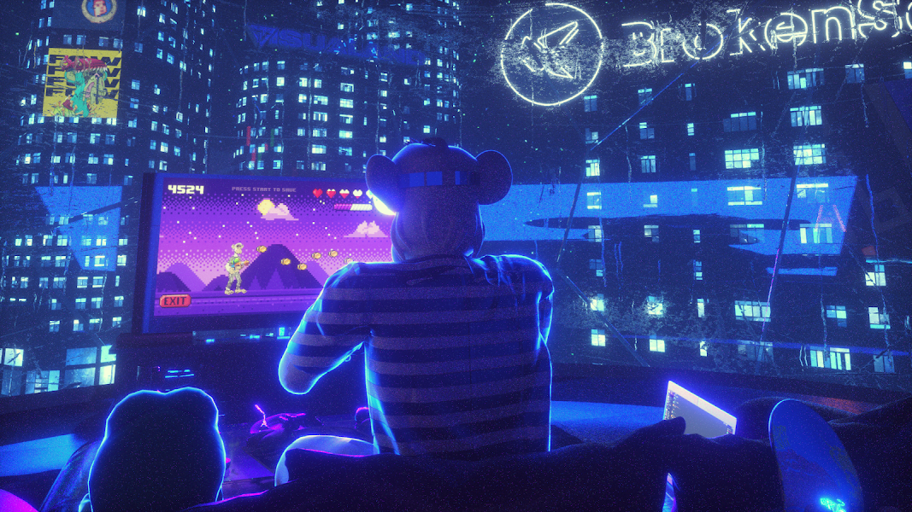

# DEGENESIS: A NEVER ENDING BOREDOM

@Eddievisual 的官方创世纪系列。 21 年 12 月 22 日收集所有四件以获得特别的东西。 ;)

DEGENESIS：永无止境的无聊 NFT - 常见问题（FAQ）
▶ 什么是退化：永无止境的无聊？
DEGENESIS: A NEVER ENDING BOREDOM 是一个 NFT (Non-fungible token) 集合。存储在区块链上的数字艺术品集合。
▶ 有多少 DEGENESIS: A NEVER ENDING BOREDOM 代币存在？
总共有 1 个 DEGENESIS：一个 NEVER ENDING BOREDOM NFT。目前，19 位所有者的钱包中至少有一个 DEGENESIS：A NEVER ENDING BOREDOM NTF。
▶ 最近卖出了多少 DEGENESIS: A NEVER ENDING BOREDOM？
过去 30 天内售出 0 次退化：一个 NEVER ENDING BOREDOM NFT。

