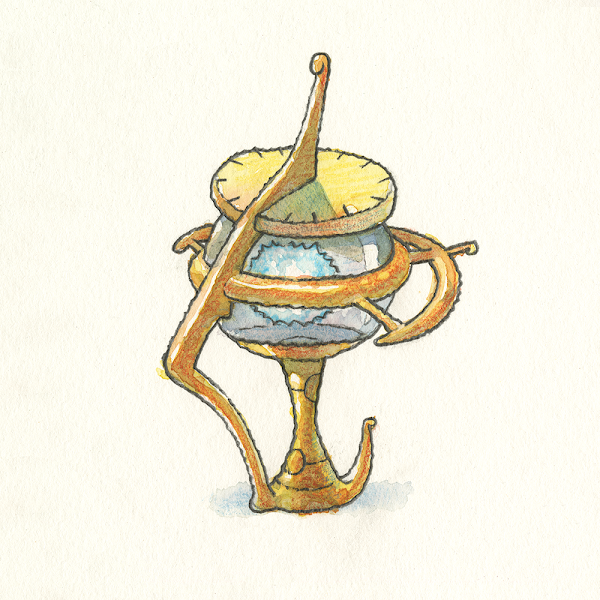

# Edenhorde Collectibles

伊登霍德收藏品NFT - 常见问题（FAQ）
▶ 什么是伊甸园收藏品？
Edenhorde Collectibles是NFT（不可替代令牌）的集合。存储在区块链上的数字艺术品的集合。
▶ 有多少个伊登霍德收藏品代币存在？
总共有6个Edenhorde Collectibles NFT.目前有1，655名所有者在他们的钱包中至少有一个Edenhorde Collectibles NTF。
▶ 最昂贵的伊登霍德收藏品销售是什么？
NFT出售的最昂贵的Edenhorde收藏品是来自Mount Puntu的Glowing Light。它在2022-06-08（3个月前）以$ 191.1的价格出售。
▶ 最近售出了多少件伊登霍德收藏品？
在过去的30天内，有26个Edenhorde收藏品NFT售出。
▶ 伊甸之主收藏品的费用是多少？
在过去的30天里，最便宜的Edenhorde Collectibles NFT销售额低于15美元，最高销售额超过65美元。在过去的30天内，Edenhorde Collectibles NFT的中位数价格为36美元。
▶ 什么是流行的伊登霍德收藏品替代品？
许多拥有Edenhorde Collectibles NFT的用户也拥有Edenhorde，Generic Profile Pictures，CCC Genesis Packaging-Ganji和Milan Quadens的“LOVE”。
伊登霍德收藏品NFT - 常见问题（FAQ）
▶ 什么是伊甸园收藏品？
Edenhorde Collectibles是NFT（不可替代令牌）的集合。存储在区块链上的数字艺术品的集合。
▶ 有多少个伊登霍德收藏品代币存在？
总共有6个Edenhorde Collectibles NFT.目前有1，655名所有者在他们的钱包中至少有一个Edenhorde Collectibles NTF。
▶ 最昂贵的伊登霍德收藏品销售是什么？
NFT出售的最昂贵的Edenhorde收藏品是来自Mount Puntu的Glowing Light。它在2022-06-08（3个月前）以$ 191.1的价格出售。
▶ 最近售出了多少件伊登霍德收藏品？
在过去的30天内，有26个Edenhorde收藏品NFT售出。
▶ 伊甸之主收藏品的费用是多少？
在过去的30天里，最便宜的Edenhorde Collectibles NFT销售额低于15美元，最高销售额超过65美元。在过去的30天内，Edenhorde Collectibles NFT的中位数价格为36美元。
▶ 什么是流行的伊登霍德收藏品替代品？
许多拥有Edenhorde Collectibles NFT的用户也拥有Edenhorde，Generic Profile Pictures，CCC Genesis Packaging-Ganji和Milan Quadens的“LOVE”。

