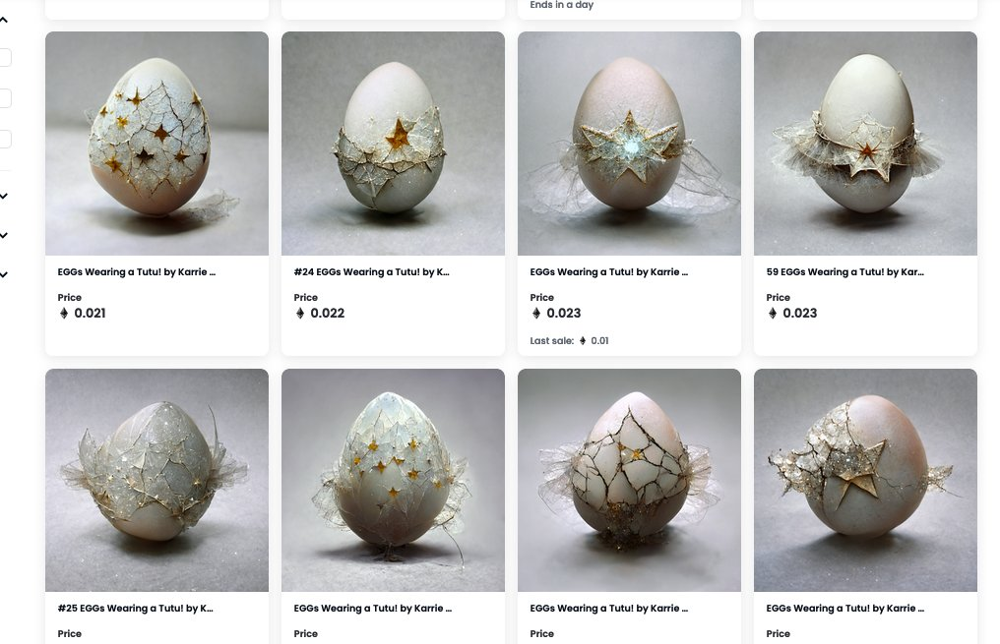

# EGGs Wearing a TUTU by Karrie Ross

259 个 NFT 的集合，ai 生成了“EGGs Wearing a Tutu！” 由 Karrie Ross 创作，并使用她的智能合约作为 nfts 上传到以太坊区块链。============ 罗斯独特的、隐喻的、异想天开的叙事、发人深省的光与空间抽象作品围绕着能量的中心主题展开。她相信创造自己能量的潜力有能力改变一个人的经历和生活环境。如果您有任何问题，请告诉我259 个 NFT 的集合，ai 生成了“ *EGGs Wearing a Tutu！” 由 Karrie Ross*创作，并使用她的智能合约作为 nfts 上传到以太坊区块链。

