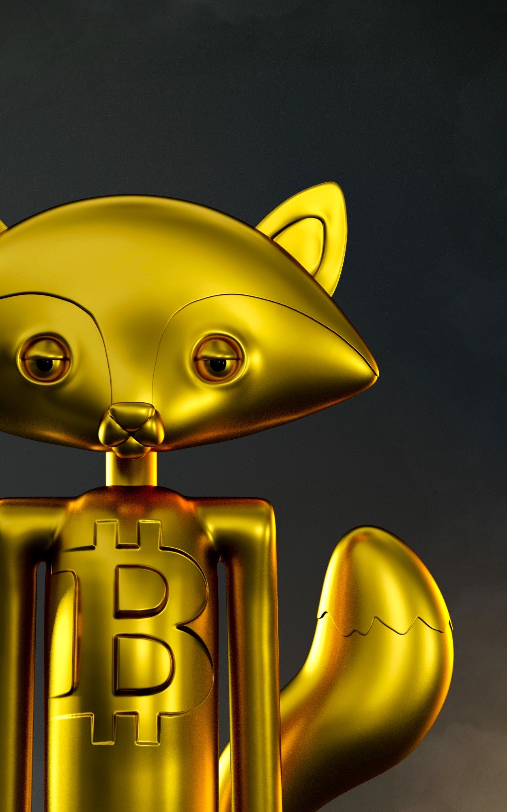

# Ego Fox

Ego Fox 是由 Eigleer Nunes 从头开始雕刻的 3D 角色项目。都是独一无二的，每一个都只有一个，风格和个性各不相同；无论是向物品、图标、文化主题或任何为每只狐狸创造独特角色的事物致敬。Ego Fox 是由 Eigleer Nunes 从头开始雕刻的 3D 角色项目。
都是独一无二的，每一个都只有一个，风格和个性各不相同；无论是向物品、图标、文化主题或任何为每只狐狸创造独特角色的事物致敬。

每个角色都是对其所体现的主题、特征或角色的艺术贡献，因此我们项目的名称的灵感来自于另一个自我的定义，即另类的自我或个性。
Ego Fox 是由以太坊区块链上的不可替代令牌 (NFT) 支持并托管在 IPFS 上的 1500 个独家可收藏 3D 雕刻角色。

我们的 Ego Fox 项目打算将创始人个人利润的 15% 捐赠给一个致力于为贫困条件下的个人进行唇裂和腭裂手术的组织，该组织的名称是 Operation Smile。

Ego Fox 艺术家 Eigleer Nunes 于 2021 年生下了他的第一个儿子，他出生时患有唇裂。Eig 选择这个组织是为了表达他对他在北美的生活环境的感激之情，在那里他儿子的唇部手术非常容易获得并且很容易获得，并承认虽然并非所有出生时患有类似疾病的人都是如此，但我们可以还是想办法帮忙。

我们生活在一个充满偏见和排他性的世界中，我们相信成为解决方案的一部分。感谢我们为这个项目所做的努力并继续投入到这个项目中，我们很荣幸能够看到更多的人无耻地微笑。

