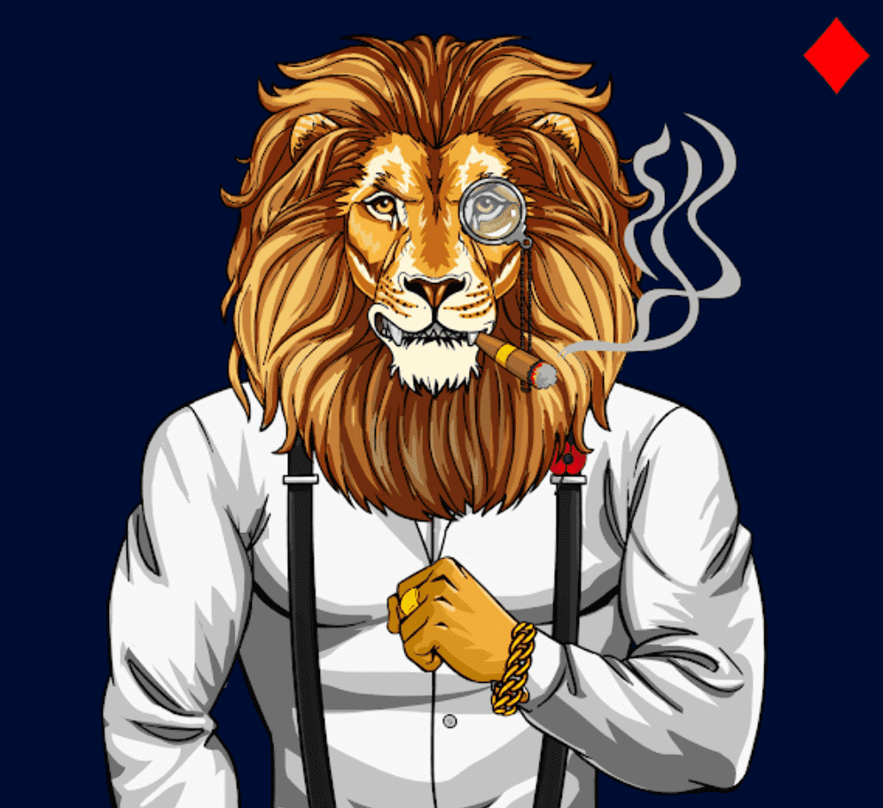

# EGS Founding Fathers (gen 1)

这是 EGS 的第一个智能合约，但是我们现在正在重新部署我们的合约并在 1 到 2 周内重新启动。这些开国元勋（第 1 代）NFT 的当前持有者在重新启动时将收到相同数量的 NFT 空投以及退还给钱包的汽油费（如果是原始铸币者）。这些 NFT 的所有者在重新发布后，还将获得 EGS 乡村俱乐部房间的私人使用权以及有限的开国元勋配饰。这些可以添加到 EGS 更衣室中您未来的赌场赛季 NFT 中。欲了解更多信息，请加入 Discord - Discord.gg/egs

