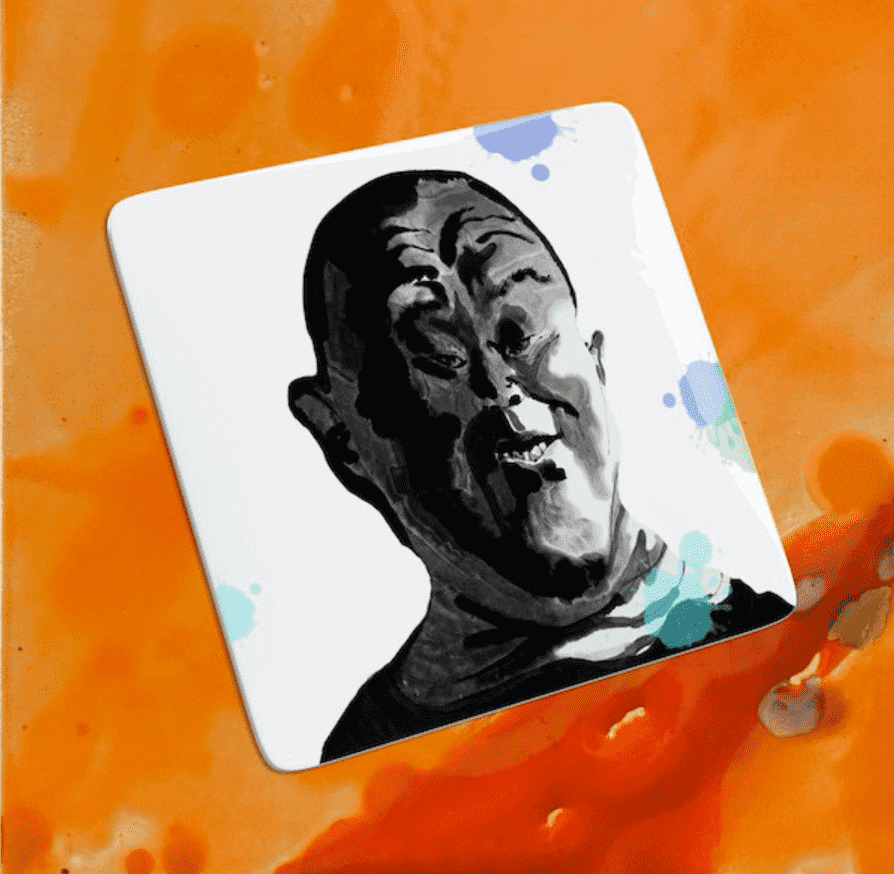

# Elemental by Fang Lijun

关于元素
方力钧的 Elemental 是一个 NFT 系列，将艺术家画作中熟悉的光头人物与土、水、火和空气的表现相结合。每幅图像的构图都传达了强烈碰撞的影响。 Elemental 的灵感来自于 Fang 的陶瓷作品，他一直认为陶瓷是探索物质性和触感的媒介。它是一种通过技术创新而进步的艺术形式，因为大规模生产和标准化使艺术服务于日常生活。在每一个 NFT 中，一个带有肖像的陶瓷板模型漂浮在一个让人联想到环境混乱的抽象环境中，呈现出偶然与必然、永恒与脆弱、创造与消失之间的悖论。为庆祝新年，Elemental 由 2022 个 NFT 组成。 Fang 创作了 10 个版本的 200 张静止图像，以及 22 个单版动画。一对一版本的收藏家将能够索取陶瓷盘子。

