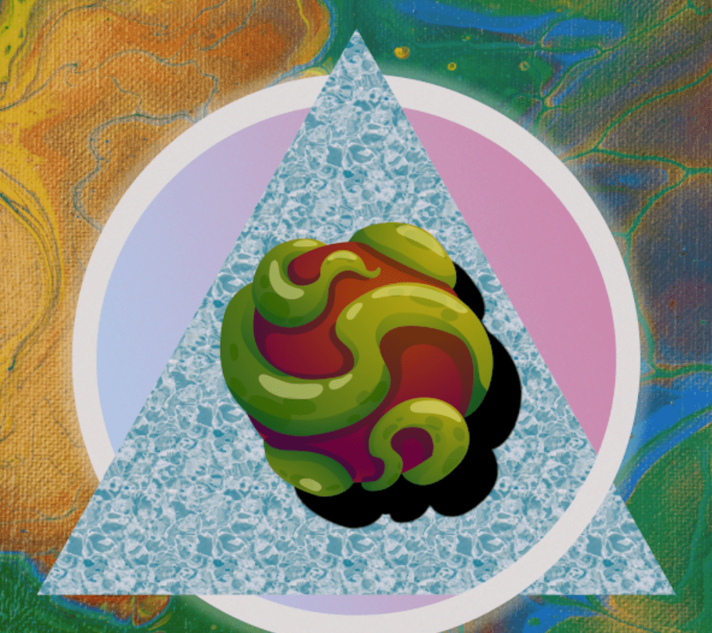

# ElementPrimeArtifacts

那么什么是元素元神器？
 2,100 件元素 Prime 神器散布在 Polygon 的宇宙中。 每个 Artifact 都是一个独特生成的 NFT，让拥有者拥有访问 The Ancients 的专属能力。 加入乐趣，成为 Element Prime Artifacts 社区的一员。
ElementPrimeArtifacts NFT - 常见问题（FAQ）
▶ 什么是 ElementPrimeArtifacts？
ElementPrimeArtifacts 是一个 NFT（不可替代令牌）集合。 存储在区块链上的数字艺术品集合。
▶ 存在多少 ElementPrimeArtifacts 代币？
总共有 2,100 个 ElementPrimeArtifacts NFT。 目前，32 位所有者的钱包中至少有一个 ElementPrimeArtifacts NTF。
▶ 最近卖出了多少 ElementPrimeArtifacts？
过去 30 天内售出了 0 个 ElementPrimeArtifacts NFT。

